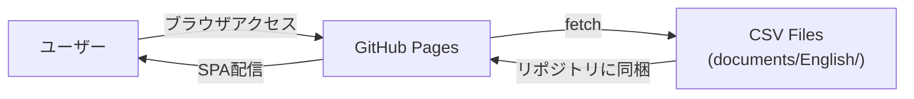
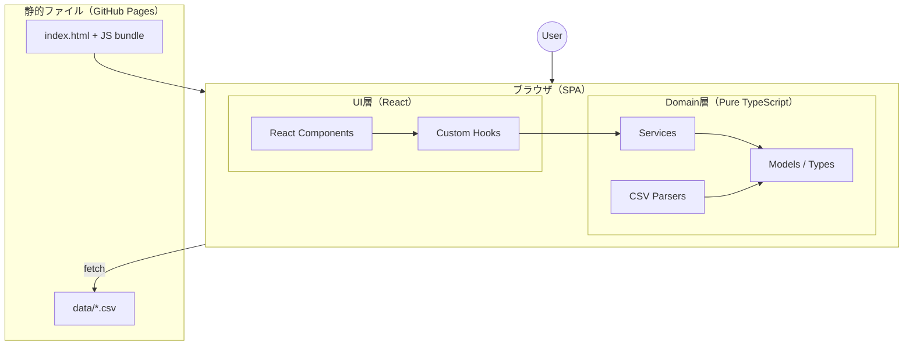
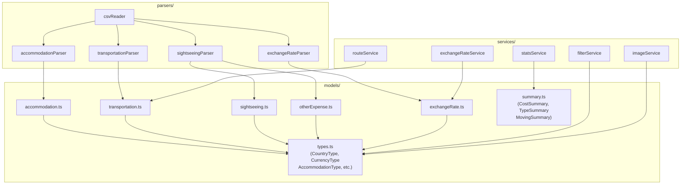
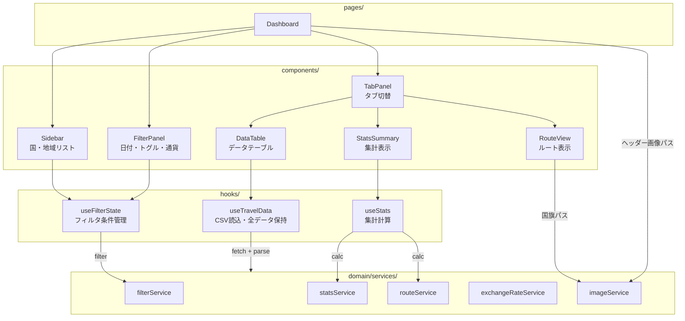
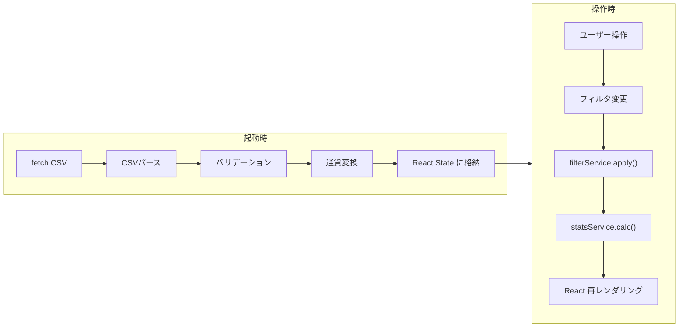

# システムアーキテクチャ

## Level 0: システムコンテキスト

## Level 1: クライアントサイドアーキテクチャ

## Level 2: Domain層 詳細

## Level 2: UI層 詳細

## Level 3: データフロー

## Level 3: 元WPFとWEBの対応表

| 元WPF層 | 元クラス | WEB版対応 |
|---|---|---|
| View (XAML) | MainWindow, MainViewPanel, SideView, UpperView | React Components (Dashboard, Sidebar, FilterPanel) |
| ViewModel | MainViewPanelVM, SideViewModel, UpperViewModel | React Hooks (useTravelData, useFilterState, useStats) |
| Model/ControlModel | ControlModel | useFilterState + filterService |
| Model/MainModel | MainModel | useTravelData hook |
| Model/ContextList | AccommodationList, TransportationList, etc. | domain/services/ + React State |
| Model/ExchangeRater | ExchangeRater | domain/services/exchangeRateService |
| Model/OptionModel | OptionModel | domain/services/imageService（画像パス生成） |
| Model/Csv | CSVReader, CSVWriter | domain/parsers/ |
| Model/Base/BaseContext | BaseContext | domain/models/ (TypeScript interface/type) |
| Model/Enumeration/ | CountryType, CurrencyType, etc. | domain/models/types.ts |
| Event (FileLoaded_, CalcCompleted_) | C# events | React useEffect + 状態変更による再レンダリング |
| RaisePropertyChanged | INotifyPropertyChanged | React setState |
| DelegateCommand | ICommand | onClick/onChange イベントハンドラ |
| DataGrid (WPF) | System.Windows.Controls.DataGrid | DataTable コンポーネント (HTML table) |
