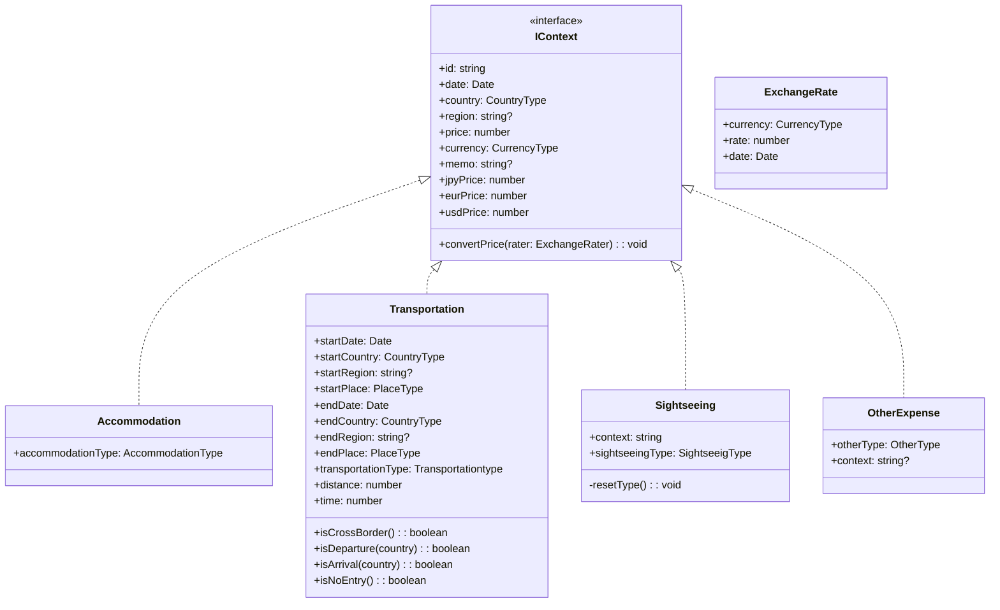
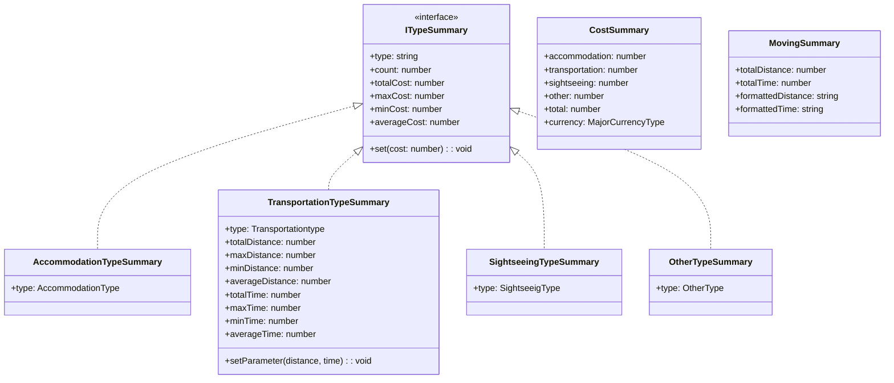
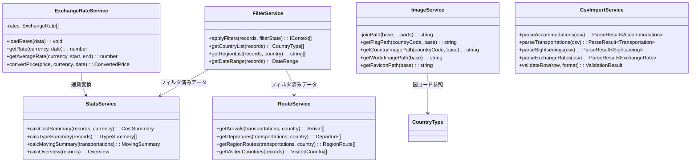
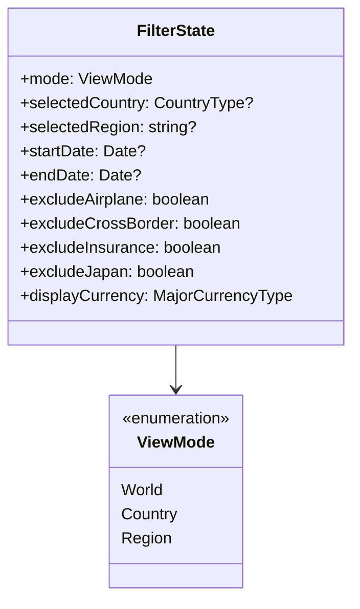
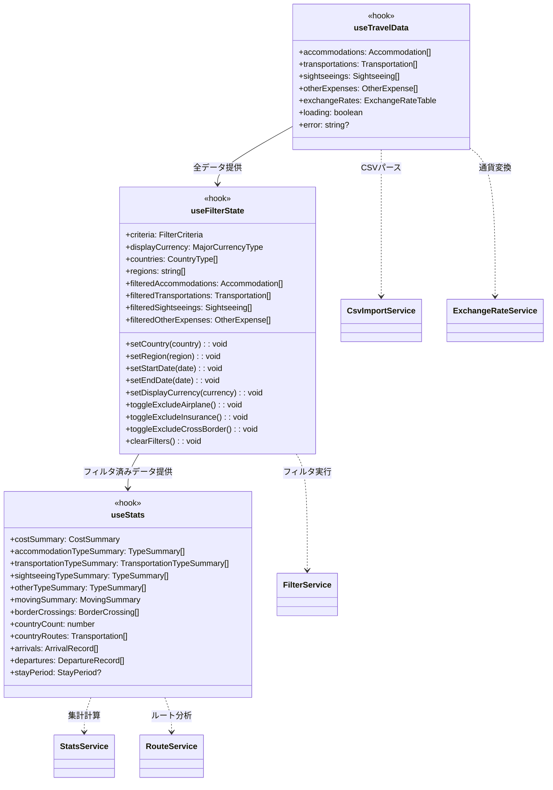

# クラス図

## ドメインエンティティ

```mermaid
classDiagram
    class IContext {
        <<interface>>
        +id: string
        +date: Date
        +country: CountryType
        +region: string?
        +price: number
        +currency: CurrencyType
        +memo: string?
        +jpyPrice: number
        +eurPrice: number
        +usdPrice: number
        +convertPrice(rater: ExchangeRater): void
    }

    class Accommodation {
        +accommodationType: AccommodationType
    }

    class Transportation {
        +startDate: Date
        +startCountry: CountryType
        +startRegion: string?
        +startPlace: PlaceType
        +endDate: Date
        +endCountry: CountryType
        +endRegion: string?
        +endPlace: PlaceType
        +transportationType: Transportationtype
        +distance: number
        +time: number
        +isCrossBorder(): boolean
        +isDeparture(country): boolean
        +isArrival(country): boolean
        +isNoEntry(): boolean
    }

    class Sightseeing {
        +context: string
        +sightseeingType: SightseeigType
        -resetType(): void
    }

    class OtherExpense {
        +otherType: OtherType
        +context: string?
    }

    class ExchangeRate {
        +currency: CurrencyType
        +rate: number
        +date: Date
    }

    IContext <|.. Accommodation
    IContext <|.. Transportation
    IContext <|.. Sightseeing
    IContext <|.. OtherExpense
```

## 集計・値オブジェクト

```mermaid
classDiagram
    class ITypeSummary {
        <<interface>>
        +type: string
        +count: number
        +totalCost: number
        +maxCost: number
        +minCost: number
        +averageCost: number
        +set(cost: number): void
    }

    class AccommodationTypeSummary {
        +type: AccommodationType
    }

    class TransportationTypeSummary {
        +type: Transportationtype
        +totalDistance: number
        +maxDistance: number
        +minDistance: number
        +averageDistance: number
        +totalTime: number
        +maxTime: number
        +minTime: number
        +averageTime: number
        +setParameter(distance, time): void
    }

    class SightseeingTypeSummary {
        +type: SightseeigType
    }

    class OtherTypeSummary {
        +type: OtherType
    }

    class CostSummary {
        +accommodation: number
        +transportation: number
        +sightseeing: number
        +other: number
        +total: number
        +currency: MajorCurrencyType
    }

    class MovingSummary {
        +totalDistance: number
        +totalTime: number
        +formattedDistance: string
        +formattedTime: string
    }

    ITypeSummary <|.. AccommodationTypeSummary
    ITypeSummary <|.. TransportationTypeSummary
    ITypeSummary <|.. SightseeingTypeSummary
    ITypeSummary <|.. OtherTypeSummary
```

## サービス層

```mermaid
classDiagram
    class ExchangeRateService {
        -rates: ExchangeRate[]
        +loadRates(data): void
        +getRate(currency, date): number
        +getAverageRate(currency, start, end): number
        +convertPrice(price, currency, date): ConvertedPrice
    }

    class FilterService {
        +applyFilters(records, filterState): IContext[]
        +getCountryList(records): CountryType[]
        +getRegionList(records, country): string[]
        +getDateRange(records): DateRange
    }

    class StatsService {
        +calcCostSummary(records, currency): CostSummary
        +calcTypeSummary(records): ITypeSummary[]
        +calcMovingSummary(transportations): MovingSummary
        +calcOverview(records): Overview
    }

    class RouteService {
        +getArrivals(transportations, country): Arrival[]
        +getDepartures(transportations, country): Departure[]
        +getRegionRoutes(transportations, country): RegionRoute[]
        +getVisitedCountries(records): VisitedCountry[]
    }

    class ImageService {
        -joinPath(base, ...parts): string
        +getFlagPath(countryCode, base): string
        +getCountryImagePath(countryCode, base): string
        +getWorldImagePath(base): string
        +getFaviconPath(base): string
    }

    class CsvImportService {
        +parseAccommodations(csv): ParseResult~Accommodation~
        +parseTransportations(csv): ParseResult~Transportation~
        +parseSightseeings(csv): ParseResult~Sightseeing~
        +parseExchangeRates(csv): ParseResult~ExchangeRate~
        +validateRow(row, format): ValidationResult
    }

    FilterService --> StatsService : フィルタ済みデータ
    FilterService --> RouteService : フィルタ済みデータ
    ExchangeRateService --> StatsService : 通貨変換
    ImageService --> CountryType : 国コード参照
```

## フィルタ状態

```mermaid
classDiagram
    class FilterState {
        +mode: ViewMode
        +selectedCountry: CountryType?
        +selectedRegion: string?
        +startDate: Date?
        +endDate: Date?
        +excludeAirplane: boolean
        +excludeCrossBorder: boolean
        +excludeInsurance: boolean
        +excludeJapan: boolean
        +displayCurrency: MajorCurrencyType
    }

    class ViewMode {
        <<enumeration>>
        World
        Country
        Region
    }

    FilterState --> ViewMode
```

## UI Hooks 層

```mermaid
classDiagram
    class useTravelData {
        <<hook>>
        +accommodations: Accommodation[]
        +transportations: Transportation[]
        +sightseeings: Sightseeing[]
        +otherExpenses: OtherExpense[]
        +exchangeRates: ExchangeRateTable
        +loading: boolean
        +error: string?
    }

    class useFilterState {
        <<hook>>
        +criteria: FilterCriteria
        +displayCurrency: MajorCurrencyType
        +countries: CountryType[]
        +regions: string[]
        +filteredAccommodations: Accommodation[]
        +filteredTransportations: Transportation[]
        +filteredSightseeings: Sightseeing[]
        +filteredOtherExpenses: OtherExpense[]
        +setCountry(country): void
        +setRegion(region): void
        +setStartDate(date): void
        +setEndDate(date): void
        +setDisplayCurrency(currency): void
        +toggleExcludeAirplane(): void
        +toggleExcludeInsurance(): void
        +toggleExcludeCrossBorder(): void
        +clearFilters(): void
    }

    class useStats {
        <<hook>>
        +costSummary: CostSummary
        +accommodationTypeSummary: TypeSummary[]
        +transportationTypeSummary: TransportationTypeSummary[]
        +sightseeingTypeSummary: TypeSummary[]
        +otherTypeSummary: TypeSummary[]
        +movingSummary: MovingSummary
        +borderCrossings: BorderCrossing[]
        +countryCount: number
        +countryRoutes: Transportation[]
        +arrivals: ArrivalRecord[]
        +departures: DepartureRecord[]
        +stayPeriod: StayPeriod?
    }

    useTravelData --> useFilterState : 全データ提供
    useFilterState --> useStats : フィルタ済みデータ提供
    useFilterState ..> FilterService : フィルタ実行
    useStats ..> StatsService : 集計計算
    useStats ..> RouteService : ルート分析
    useTravelData ..> CsvImportService : CSVパース
    useTravelData ..> ExchangeRateService : 通貨変換
```
