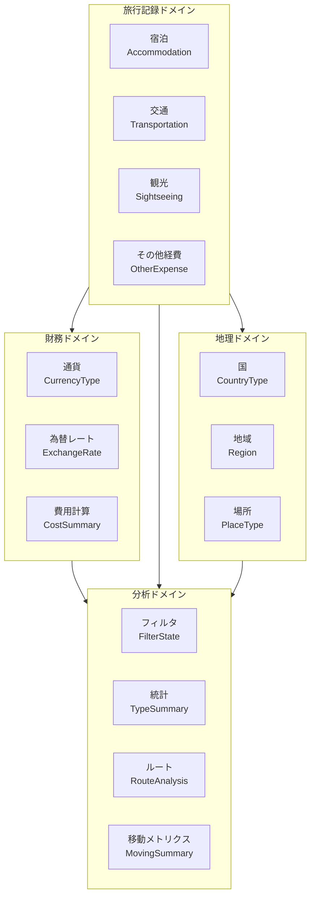
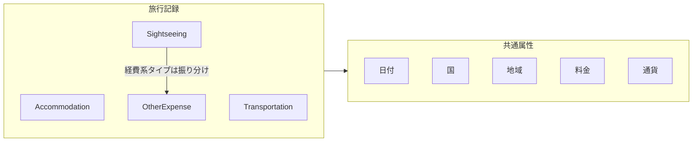
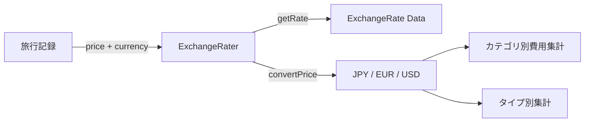
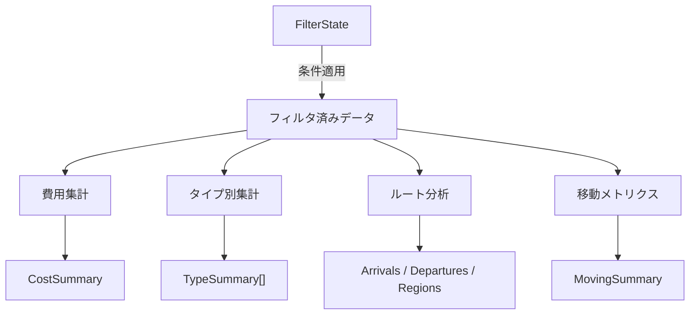

# ドメインモデル

## Level 1: ドメイン概念マップ

```mermaid
graph TB
    subgraph TravelRecord["旅行記録ドメイン"]
        Acc[宿泊<br/>Accommodation]
        Trans[交通<br/>Transportation]
        Sight[観光<br/>Sightseeing]
        Other[その他経費<br/>OtherExpense]
    end

    subgraph Geography["地理ドメイン"]
        Country[国<br/>CountryType]
        Region[地域<br/>Region]
        Place[場所<br/>PlaceType]
    end

    subgraph Finance["財務ドメイン"]
        Currency[通貨<br/>CurrencyType]
        ExRate[為替レート<br/>ExchangeRate]
        Cost[費用計算<br/>CostSummary]
    end

    subgraph Analytics["分析ドメイン"]
        Filter[フィルタ<br/>FilterState]
        Stats[統計<br/>TypeSummary]
        Route[ルート<br/>RouteAnalysis]
        Moving[移動メトリクス<br/>MovingSummary]
    end

    TravelRecord --> Geography
    TravelRecord --> Finance
    Finance --> Analytics
    TravelRecord --> Analytics
    Geography --> Analytics
```

## Level 2: 旅行記録の関係

```mermaid
graph LR
    subgraph Records["旅行記録"]
        Acc[Accommodation]
        Trans[Transportation]
        Sight[Sightseeing]
        Other[OtherExpense]
    end

    Sight -->|経費系タイプは振り分け| Other

    subgraph SharedProps["共通属性"]
        Date[日付]
        Country[国]
        Region[地域]
        Price[料金]
        Currency[通貨]
    end

    Records --> SharedProps
```

## Level 2: 財務ドメイン

```mermaid
graph LR
    Record[旅行記録] -->|price + currency| ExRate[ExchangeRater]
    ExRate -->|getRate| RateData[ExchangeRate Data]
    ExRate -->|convertPrice| Converted[JPY / EUR / USD]
    Converted --> CostSummary[カテゴリ別費用集計]
    Converted --> TypeSummary[タイプ別集計]
```

## Level 2: 分析ドメイン

```mermaid
graph TB
    Filter[FilterState] -->|条件適用| FilteredData[フィルタ済みデータ]
    FilteredData --> CostCalc[費用集計]
    FilteredData --> TypeCalc[タイプ別集計]
    FilteredData --> RouteCalc[ルート分析]
    FilteredData --> MovingCalc[移動メトリクス]

    CostCalc --> CostSummary[CostSummary]
    TypeCalc --> TypeSummary["TypeSummary[]"]
    RouteCalc --> RouteInfo["Arrivals / Departures / Regions"]
    MovingCalc --> MovingSummary[MovingSummary]
```
