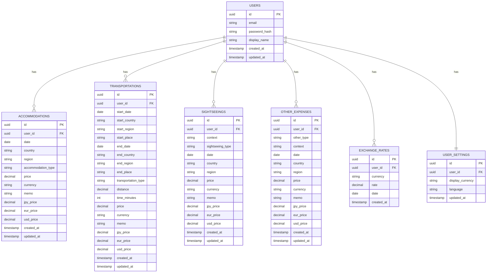

# ER図

## データベースER図

## 列挙値テーブル（参考: アプリケーションコードで定義）

| テーブル列 | 列挙型 | 格納形式 |
|---|---|---|
| country | CountryType | 文字列（"JPN", "USA", ...） |
| currency | CurrencyType | 文字列（"JPY", "EUR", ...） |
| accommodation_type | AccommodationType | 文字列（"Hotel", "Domitory", ...） |
| transportation_type | Transportationtype | 文字列（"Train", "Bus", ...） |
| sightseeing_type | SightseeigType | 文字列（"Museum", "Beach", ...） |
| other_type | OtherType | 文字列（"Insurance", "Shopping", ...） |
| start_place / end_place | PlaceType | 文字列（"Station", "Airport", ...） |

## インデックス設計

| テーブル | インデックス | 用途 |
|---|---|---|
| ACCOMMODATIONS | (user_id, date) | 日付範囲検索 |
| ACCOMMODATIONS | (user_id, country) | 国フィルタ |
| TRANSPORTATIONS | (user_id, start_date) | 日付範囲検索 |
| TRANSPORTATIONS | (user_id, start_country, end_country) | ルート分析 |
| SIGHTSEEINGS | (user_id, date) | 日付範囲検索 |
| SIGHTSEEINGS | (user_id, country) | 国フィルタ |
| OTHER_EXPENSES | (user_id, date) | 日付範囲検索 |
| EXCHANGE_RATES | (user_id, currency, date) | レート取得 |
