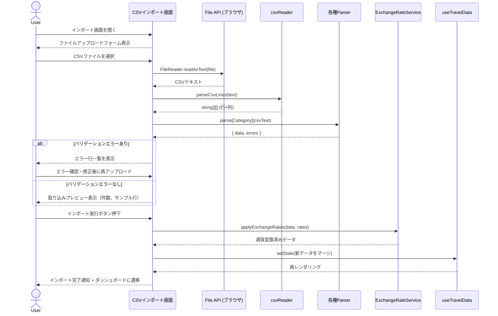
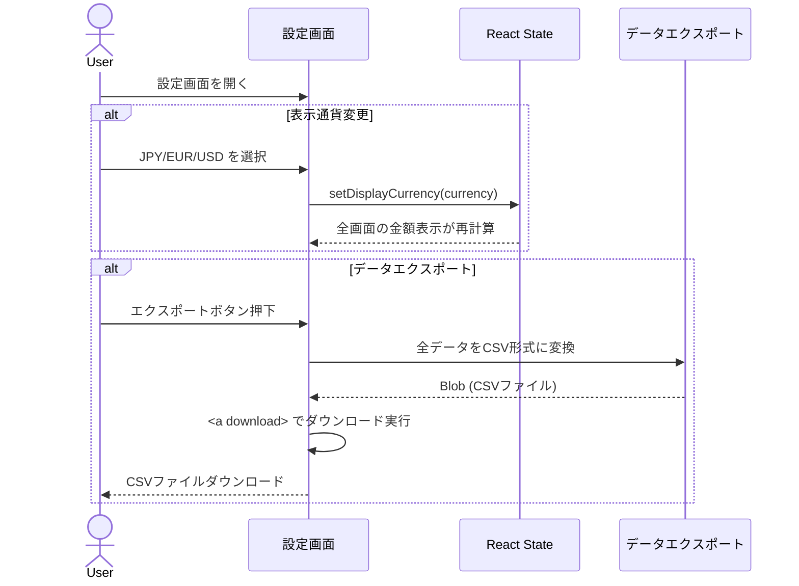

# シーケンス図: CSVインポート画面

※ P-007（CSVインポート画面）は要件定義済み・未実装。本図は実装時の設計指針。

## CSVファイルインポートフロー

```mermaid
sequenceDiagram
    actor User
    participant UI as CSVインポート画面
    participant FileAPI as File API (ブラウザ)
    participant CsvReader as csvReader
    participant Parser as 各種Parser
    participant ExchSvc as ExchangeRateService
    participant Hook as useTravelData

    User->>UI: インポート画面を開く
    UI-->>User: ファイルアップロードフォーム表示

    User->>UI: CSVファイルを選択
    UI->>FileAPI: FileReader.readAsText(file)
    FileAPI-->>UI: CSVテキスト

    UI->>CsvReader: parseCsvLines(text)
    CsvReader-->>UI: string[][] (行×列)

    UI->>Parser: parse[Category](csvText)
    Parser-->>UI: { data, errors }

    alt バリデーションエラーあり
        UI-->>User: エラー行一覧を表示
        User->>UI: エラー確認・修正後に再アップロード
    else バリデーションエラーなし
        UI-->>User: 取り込みプレビュー表示（件数、サンプル行）
    end

    User->>UI: インポート実行ボタン押下

    UI->>ExchSvc: applyExchangeRates(data, rates)
    ExchSvc-->>UI: 通貨変換済みデータ

    UI->>Hook: setState(新データをマージ)
    Hook-->>UI: 再レンダリング
    UI-->>User: インポート完了通知 + ダッシュボードに遷移
```

## 設定画面フロー（P-008）

※ P-008（設定画面）は要件定義済み・未実装。

```mermaid
sequenceDiagram
    actor User
    participant UI as 設定画面
    participant State as React State
    participant Export as データエクスポート

    User->>UI: 設定画面を開く

    alt 表示通貨変更
        User->>UI: JPY/EUR/USD を選択
        UI->>State: setDisplayCurrency(currency)
        State-->>UI: 全画面の金額表示が再計算
    end

    alt データエクスポート
        User->>UI: エクスポートボタン押下
        UI->>Export: 全データをCSV形式に変換
        Export-->>UI: Blob (CSVファイル)
        UI->>UI: <a download> でダウンロード実行
        UI-->>User: CSVファイルダウンロード
    end
```
