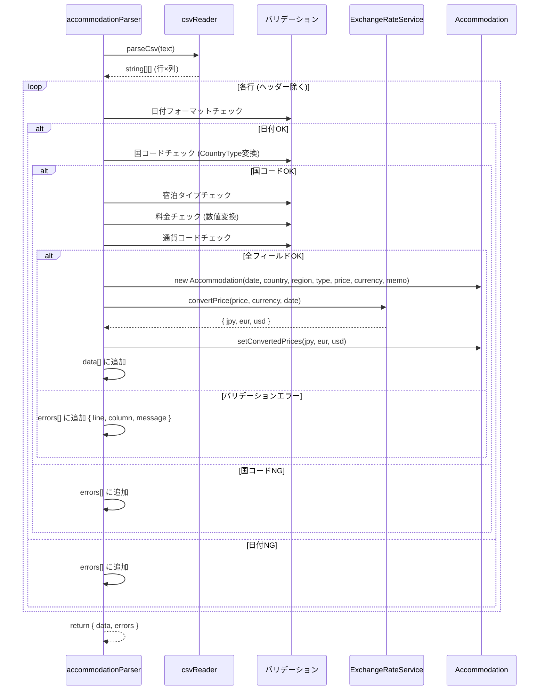
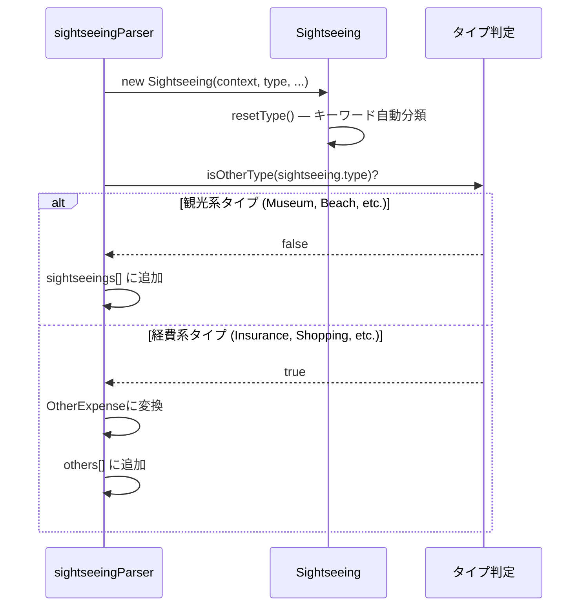
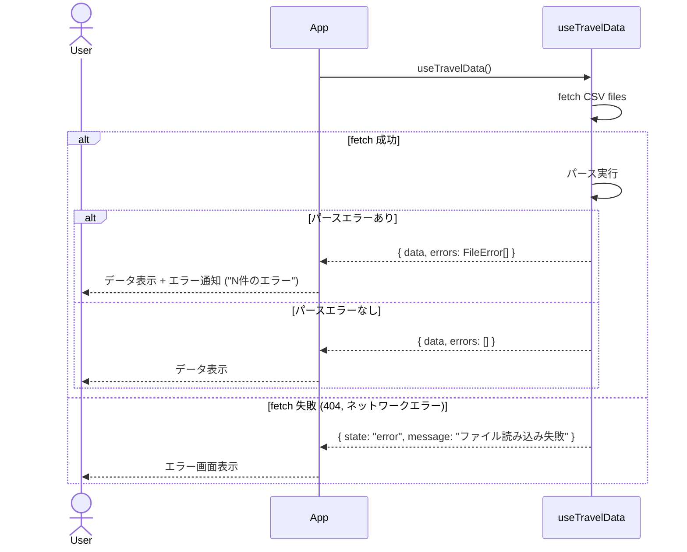

# シーケンス図: データ読み込み詳細

## CSVパース詳細（宿泊の例）

```mermaid
sequenceDiagram
    participant Parser as accommodationParser
    participant CsvReader as csvReader
    participant Validator as バリデーション
    participant ExchSvc as ExchangeRateService
    participant Model as Accommodation

    Parser->>CsvReader: parseCsv(text)
    CsvReader-->>Parser: string[][] (行×列)

    loop 各行 (ヘッダー除く)
        Parser->>Validator: 日付フォーマットチェック
        alt 日付OK
            Parser->>Validator: 国コードチェック (CountryType変換)
            alt 国コードOK
                Parser->>Validator: 宿泊タイプチェック
                Parser->>Validator: 料金チェック (数値変換)
                Parser->>Validator: 通貨コードチェック
                alt 全フィールドOK
                    Parser->>Model: new Accommodation(date, country, region, type, price, currency, memo)
                    Parser->>ExchSvc: convertPrice(price, currency, date)
                    ExchSvc-->>Parser: { jpy, eur, usd }
                    Parser->>Model: setConvertedPrices(jpy, eur, usd)
                    Parser->>Parser: data[] に追加
                else バリデーションエラー
                    Parser->>Parser: errors[] に追加 { line, column, message }
                end
            else 国コードNG
                Parser->>Parser: errors[] に追加
            end
        else 日付NG
            Parser->>Parser: errors[] に追加
        end
    end

    Parser-->>Parser: return { data, errors }
```

## 観光→その他経費の振り分け

```mermaid
sequenceDiagram
    participant Parser as sightseeingParser
    participant Model as Sightseeing
    participant TypeCheck as タイプ判定

    Parser->>Model: new Sightseeing(context, type, ...)
    Model->>Model: resetType() — キーワード自動分類

    Parser->>TypeCheck: isOtherType(sightseeing.type)?

    alt 観光系タイプ (Museum, Beach, etc.)
        TypeCheck-->>Parser: false
        Parser->>Parser: sightseeings[] に追加
    else 経費系タイプ (Insurance, Shopping, etc.)
        TypeCheck-->>Parser: true
        Parser->>Parser: OtherExpenseに変換
        Parser->>Parser: others[] に追加
    end
```

## エラーハンドリング

```mermaid
sequenceDiagram
    actor User
    participant App as App
    participant Hook as useTravelData

    App->>Hook: useTravelData()
    Hook->>Hook: fetch CSV files

    alt fetch 成功
        Hook->>Hook: パース実行
        alt パースエラーあり
            Hook-->>App: { data, errors: FileError[] }
            App-->>User: データ表示 + エラー通知 ("N件のエラー")
        else パースエラーなし
            Hook-->>App: { data, errors: [] }
            App-->>User: データ表示
        end
    else fetch 失敗 (404, ネットワークエラー)
        Hook-->>App: { state: "error", message: "ファイル読み込み失敗" }
        App-->>User: エラー画面表示
    end
```
