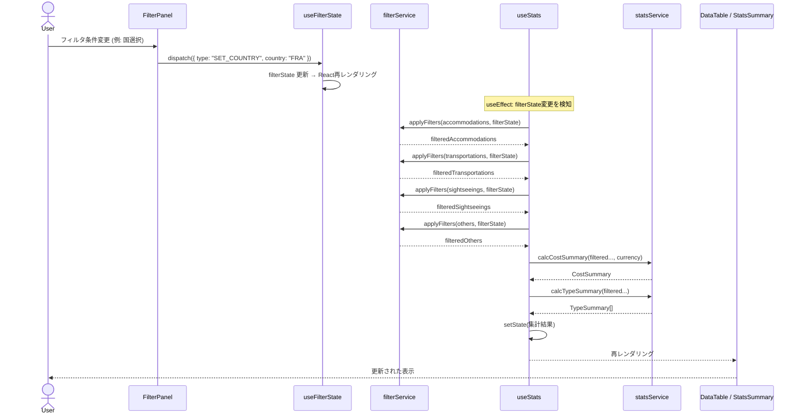
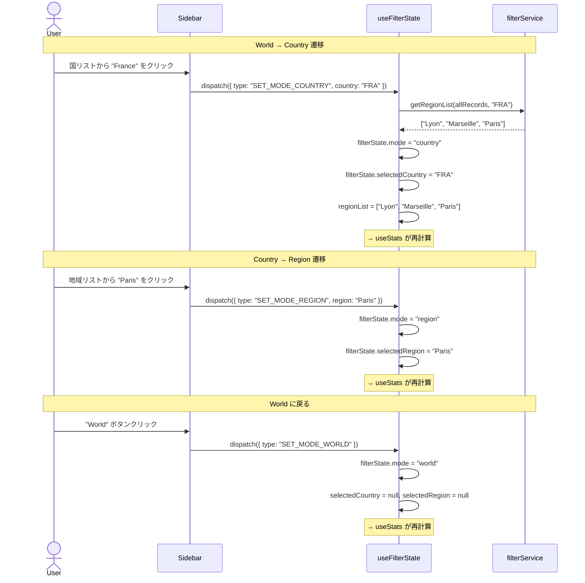
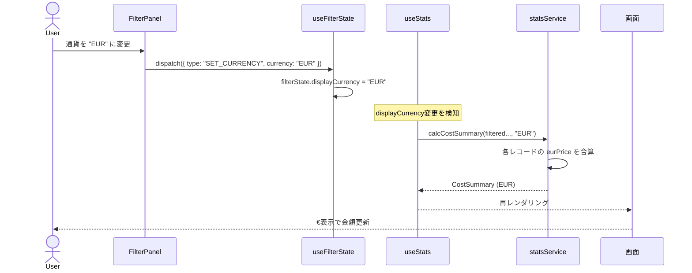

# シーケンス図: フィルタリング・集計

## フィルタ変更→再計算（全てクライアントサイド）

```mermaid
sequenceDiagram
    actor User
    participant FilterUI as FilterPanel
    participant FilterHook as useFilterState
    participant FilterSvc as filterService
    participant StatsHook as useStats
    participant StatsSvc as statsService
    participant UI as DataTable / StatsSummary

    User->>FilterUI: フィルタ条件変更 (例: 国選択)
    FilterUI->>FilterHook: dispatch({ type: "SET_COUNTRY", country: "FRA" })
    FilterHook->>FilterHook: filterState 更新 → React再レンダリング

    Note over StatsHook: useEffect: filterState変更を検知

    StatsHook->>FilterSvc: applyFilters(accommodations, filterState)
    FilterSvc-->>StatsHook: filteredAccommodations
    StatsHook->>FilterSvc: applyFilters(transportations, filterState)
    FilterSvc-->>StatsHook: filteredTransportations
    StatsHook->>FilterSvc: applyFilters(sightseeings, filterState)
    FilterSvc-->>StatsHook: filteredSightseeings
    StatsHook->>FilterSvc: applyFilters(others, filterState)
    FilterSvc-->>StatsHook: filteredOthers

    StatsHook->>StatsSvc: calcCostSummary(filtered..., currency)
    StatsSvc-->>StatsHook: CostSummary
    StatsHook->>StatsSvc: calcTypeSummary(filtered...)
    StatsSvc-->>StatsHook: TypeSummary[]

    StatsHook->>StatsHook: setState(集計結果)
    StatsHook-->>UI: 再レンダリング
    UI-->>User: 更新された表示
```

## 表示モード遷移

```mermaid
sequenceDiagram
    actor User
    participant Sidebar as Sidebar
    participant Hook as useFilterState
    participant FilterSvc as filterService

    Note over User,FilterSvc: World → Country 遷移
    User->>Sidebar: 国リストから "France" をクリック
    Sidebar->>Hook: dispatch({ type: "SET_MODE_COUNTRY", country: "FRA" })
    Hook->>FilterSvc: getRegionList(allRecords, "FRA")
    FilterSvc-->>Hook: ["Lyon", "Marseille", "Paris"]
    Hook->>Hook: filterState.mode = "country"
    Hook->>Hook: filterState.selectedCountry = "FRA"
    Hook->>Hook: regionList = ["Lyon", "Marseille", "Paris"]
    Note over Hook: → useStats が再計算

    Note over User,FilterSvc: Country → Region 遷移
    User->>Sidebar: 地域リストから "Paris" をクリック
    Sidebar->>Hook: dispatch({ type: "SET_MODE_REGION", region: "Paris" })
    Hook->>Hook: filterState.mode = "region"
    Hook->>Hook: filterState.selectedRegion = "Paris"
    Note over Hook: → useStats が再計算

    Note over User,FilterSvc: World に戻る
    User->>Sidebar: "World" ボタンクリック
    Sidebar->>Hook: dispatch({ type: "SET_MODE_WORLD" })
    Hook->>Hook: filterState.mode = "world"
    Hook->>Hook: selectedCountry = null, selectedRegion = null
    Note over Hook: → useStats が再計算
```

## 通貨切替

```mermaid
sequenceDiagram
    actor User
    participant FilterUI as FilterPanel
    participant Hook as useFilterState
    participant StatsHook as useStats
    participant StatsSvc as statsService
    participant UI as 画面

    User->>FilterUI: 通貨を "EUR" に変更
    FilterUI->>Hook: dispatch({ type: "SET_CURRENCY", currency: "EUR" })
    Hook->>Hook: filterState.displayCurrency = "EUR"

    Note over StatsHook: displayCurrency変更を検知
    StatsHook->>StatsSvc: calcCostSummary(filtered..., "EUR")
    StatsSvc->>StatsSvc: 各レコードの eurPrice を合算
    StatsSvc-->>StatsHook: CostSummary (EUR)

    StatsHook-->>UI: 再レンダリング
    UI-->>User: €表示で金額更新
```
