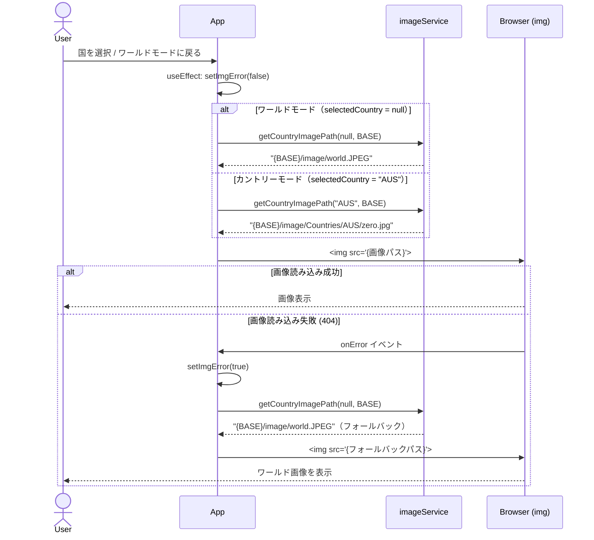
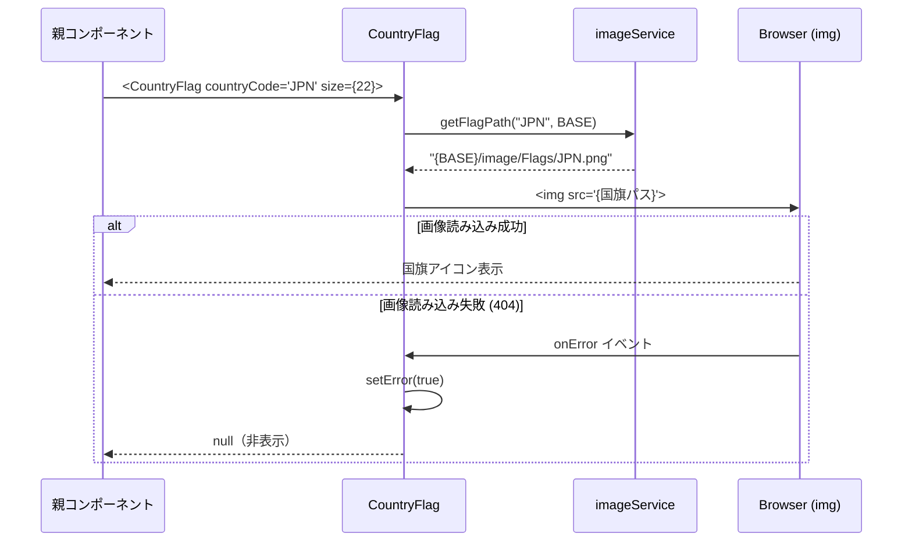
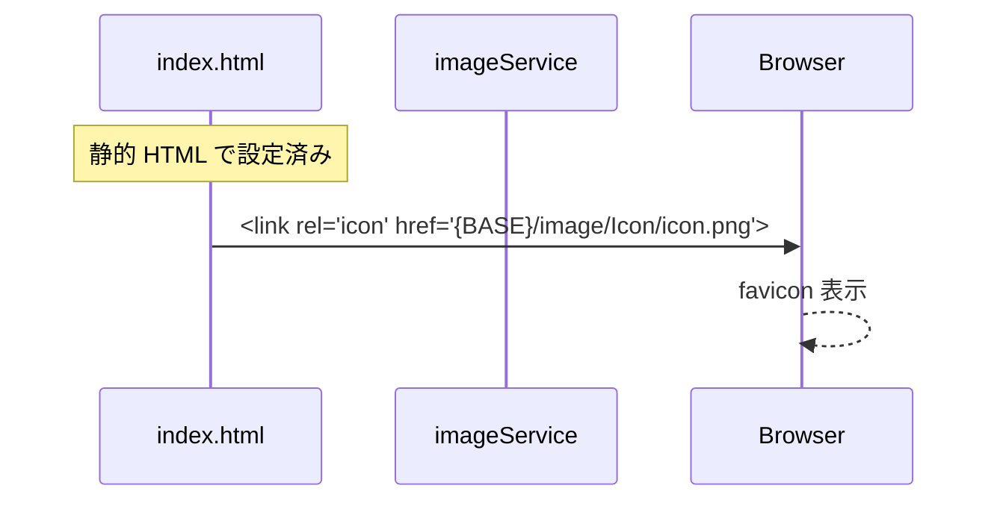

# シーケンス図: 画像読み込み

## ヘッダー画像表示（App コンポーネント）

```mermaid
sequenceDiagram
    actor User
    participant App as App
    participant ImgSvc as imageService
    participant Browser as Browser (img)

    User->>App: 国を選択 / ワールドモードに戻る
    App->>App: useEffect: setImgError(false)

    alt ワールドモード（selectedCountry = null）
        App->>ImgSvc: getCountryImagePath(null, BASE)
        ImgSvc-->>App: "{BASE}/image/world.JPEG"
    else カントリーモード（selectedCountry = "AUS"）
        App->>ImgSvc: getCountryImagePath("AUS", BASE)
        ImgSvc-->>App: "{BASE}/image/Countries/AUS/zero.jpg"
    end

    App->>Browser: <img src="{画像パス}">

    alt 画像読み込み成功
        Browser-->>User: 画像表示
    else 画像読み込み失敗 (404)
        Browser->>App: onError イベント
        App->>App: setImgError(true)
        App->>ImgSvc: getCountryImagePath(null, BASE)
        ImgSvc-->>App: "{BASE}/image/world.JPEG"（フォールバック）
        App->>Browser: <img src="{フォールバックパス}">
        Browser-->>User: ワールド画像を表示
    end
```

## 国旗表示（CountryFlag コンポーネント）

```mermaid
sequenceDiagram
    participant Parent as 親コンポーネント
    participant Flag as CountryFlag
    participant ImgSvc as imageService
    participant Browser as Browser (img)

    Parent->>Flag: <CountryFlag countryCode="JPN" size={22}>
    Flag->>ImgSvc: getFlagPath("JPN", BASE)
    ImgSvc-->>Flag: "{BASE}/image/Flags/JPN.png"
    Flag->>Browser: <img src="{国旗パス}">

    alt 画像読み込み成功
        Browser-->>Parent: 国旗アイコン表示
    else 画像読み込み失敗 (404)
        Browser->>Flag: onError イベント
        Flag->>Flag: setError(true)
        Flag-->>Parent: null（非表示）
    end
```

## favicon 設定

```mermaid
sequenceDiagram
    participant HTML as index.html
    participant ImgSvc as imageService
    participant Browser as Browser

    Note over HTML: 静的 HTML で設定済み
    HTML->>Browser: <link rel="icon" href="{BASE}/image/Icon/icon.png">
    Browser-->>Browser: favicon 表示
```
