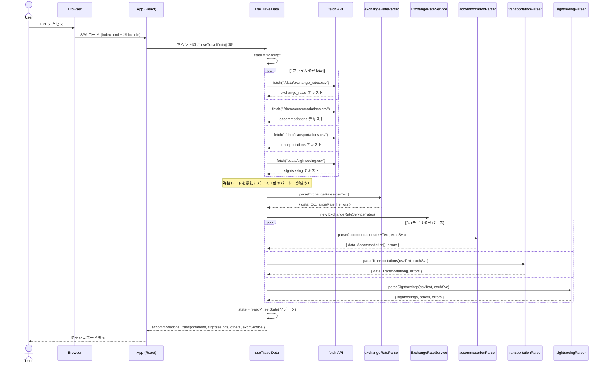

# シーケンス図: 初期化

## アプリケーション起動・データ読み込み

```mermaid
sequenceDiagram
    actor User
    participant Browser as Browser
    participant App as App (React)
    participant Hook as useTravelData
    participant Fetch as fetch API
    participant ExchParser as exchangeRateParser
    participant ExchSvc as ExchangeRateService
    participant AccParser as accommodationParser
    participant TransParser as transportationParser
    participant SightParser as sightseeingParser

    User->>Browser: URL アクセス
    Browser->>App: SPA ロード (index.html + JS bundle)
    App->>Hook: マウント時に useTravelData() 実行

    Hook->>Hook: state = "loading"

    par 4ファイル並列fetch
        Hook->>Fetch: fetch("./data/exchange_rates.csv")
        Fetch-->>Hook: exchange_rates テキスト
    and
        Hook->>Fetch: fetch("./data/accommodations.csv")
        Fetch-->>Hook: accommodations テキスト
    and
        Hook->>Fetch: fetch("./data/transportations.csv")
        Fetch-->>Hook: transportations テキスト
    and
        Hook->>Fetch: fetch("./data/sightseeing.csv")
        Fetch-->>Hook: sightseeing テキスト
    end

    Note over Hook: 為替レートを最初にパース（他のパーサーが使う）
    Hook->>ExchParser: parseExchangeRates(csvText)
    ExchParser-->>Hook: { data: ExchangeRate[], errors }
    Hook->>ExchSvc: new ExchangeRateService(rates)

    par 3カテゴリ並列パース
        Hook->>AccParser: parseAccommodations(csvText, exchSvc)
        AccParser-->>Hook: { data: Accommodation[], errors }
    and
        Hook->>TransParser: parseTransportations(csvText, exchSvc)
        TransParser-->>Hook: { data: Transportation[], errors }
    and
        Hook->>SightParser: parseSightseeings(csvText, exchSvc)
        SightParser-->>Hook: { sightseeings, others, errors }
    end

    Hook->>Hook: state = "ready", setState(全データ)
    Hook-->>App: { accommodations, transportations, sightseeings, others, exchService }
    App-->>User: ダッシュボード表示
```
