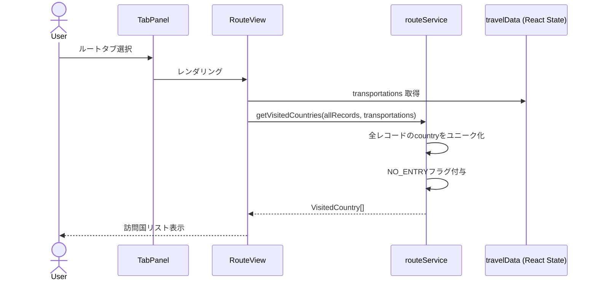
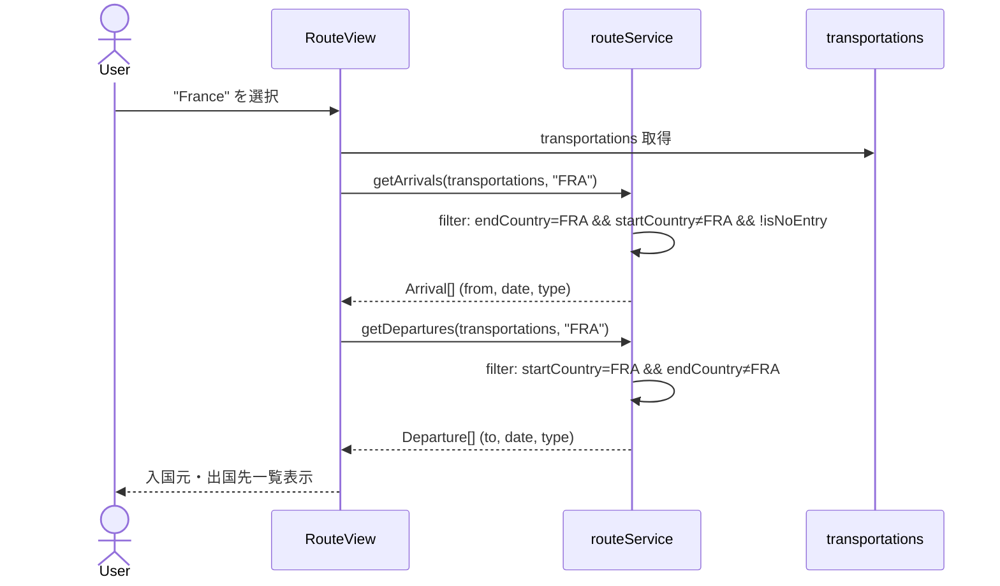
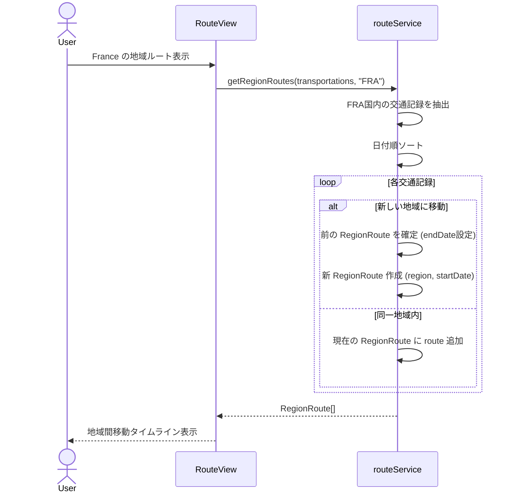
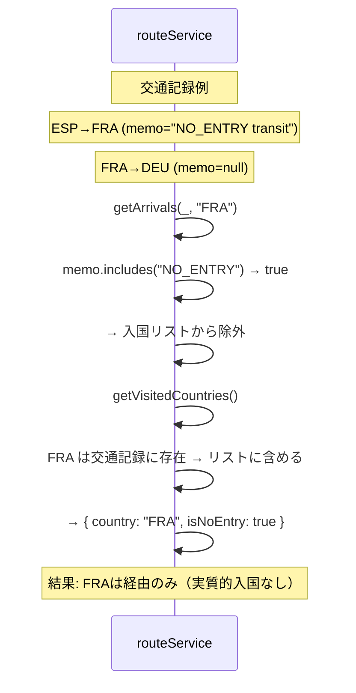

# シーケンス図: ルート分析

## ルートタブ表示（全てクライアントサイド）

```mermaid
sequenceDiagram
    actor User
    participant TabPanel as TabPanel
    participant RouteView as RouteView
    participant RouteSvc as routeService
    participant Data as travelData (React State)

    User->>TabPanel: ルートタブ選択
    TabPanel->>RouteView: レンダリング

    RouteView->>Data: transportations 取得
    RouteView->>RouteSvc: getVisitedCountries(allRecords, transportations)
    RouteSvc->>RouteSvc: 全レコードのcountryをユニーク化
    RouteSvc->>RouteSvc: NO_ENTRYフラグ付与
    RouteSvc-->>RouteView: VisitedCountry[]
    RouteView-->>User: 訪問国リスト表示
```

## 国別ルート詳細

```mermaid
sequenceDiagram
    actor User
    participant RouteView as RouteView
    participant RouteSvc as routeService
    participant Data as transportations

    User->>RouteView: "France" を選択
    RouteView->>Data: transportations 取得

    RouteView->>RouteSvc: getArrivals(transportations, "FRA")
    RouteSvc->>RouteSvc: filter: endCountry=FRA && startCountry≠FRA && !isNoEntry
    RouteSvc-->>RouteView: Arrival[] (from, date, type)

    RouteView->>RouteSvc: getDepartures(transportations, "FRA")
    RouteSvc->>RouteSvc: filter: startCountry=FRA && endCountry≠FRA
    RouteSvc-->>RouteView: Departure[] (to, date, type)

    RouteView-->>User: 入国元・出国先一覧表示
```

## 地域間移動詳細

```mermaid
sequenceDiagram
    actor User
    participant RouteView as RouteView
    participant RouteSvc as routeService

    User->>RouteView: France の地域ルート表示
    RouteView->>RouteSvc: getRegionRoutes(transportations, "FRA")

    RouteSvc->>RouteSvc: FRA国内の交通記録を抽出
    RouteSvc->>RouteSvc: 日付順ソート

    loop 各交通記録
        alt 新しい地域に移動
            RouteSvc->>RouteSvc: 前の RegionRoute を確定 (endDate設定)
            RouteSvc->>RouteSvc: 新 RegionRoute 作成 (region, startDate)
        else 同一地域内
            RouteSvc->>RouteSvc: 現在の RegionRoute に route 追加
        end
    end

    RouteSvc-->>RouteView: RegionRoute[]
    RouteView-->>User: 地域間移動タイムライン表示
```

## NO_ENTRY処理

```mermaid
sequenceDiagram
    participant RouteSvc as routeService

    Note over RouteSvc: 交通記録例
    Note over RouteSvc: ESP→FRA (memo="NO_ENTRY transit")
    Note over RouteSvc: FRA→DEU (memo=null)

    RouteSvc->>RouteSvc: getArrivals(_, "FRA")
    RouteSvc->>RouteSvc: memo.includes("NO_ENTRY") → true
    RouteSvc->>RouteSvc: → 入国リストから除外

    RouteSvc->>RouteSvc: getVisitedCountries()
    RouteSvc->>RouteSvc: FRA は交通記録に存在 → リストに含める
    RouteSvc->>RouteSvc: → { country: "FRA", isNoEntry: true }

    Note over RouteSvc: 結果: FRAは経由のみ（実質的入国なし）
```
