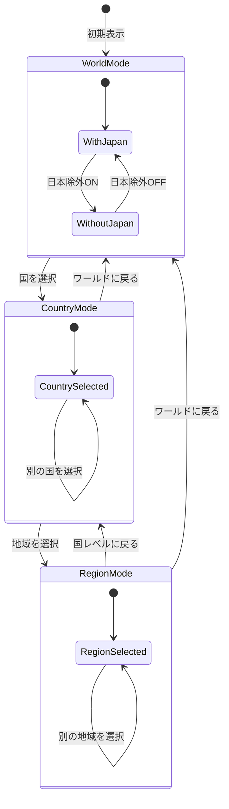
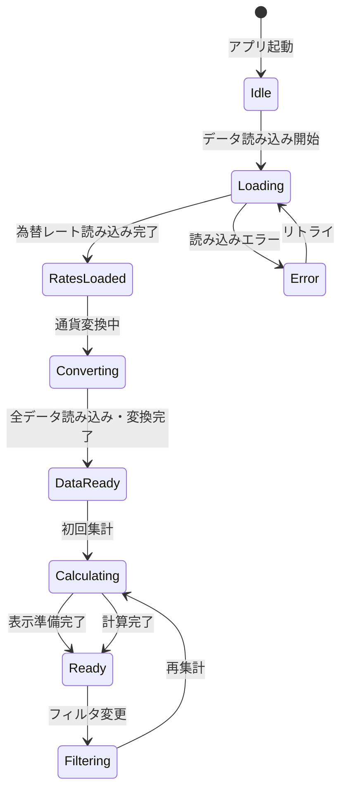
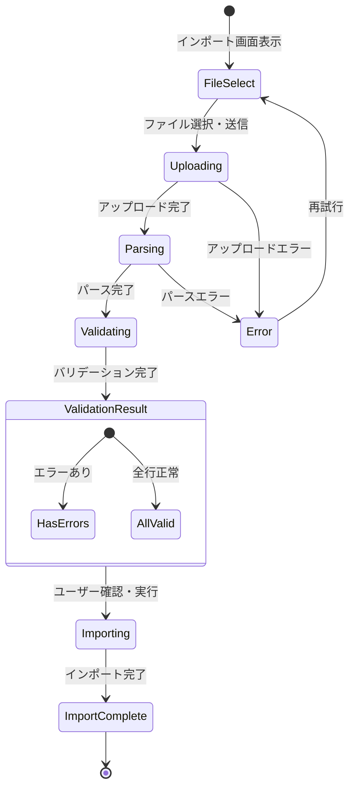
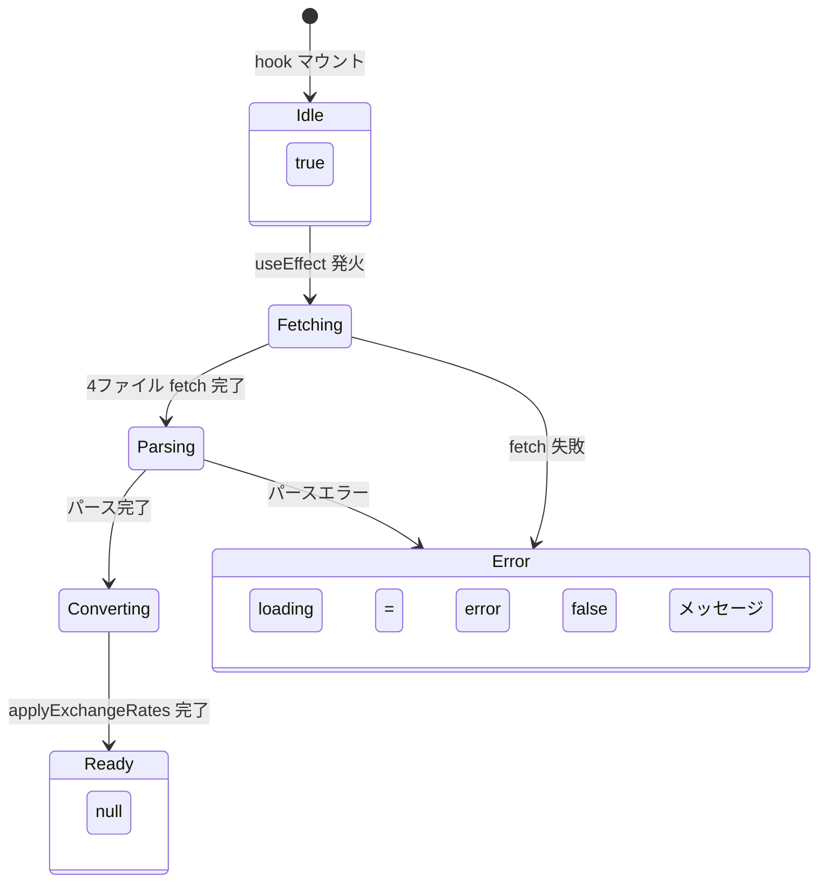
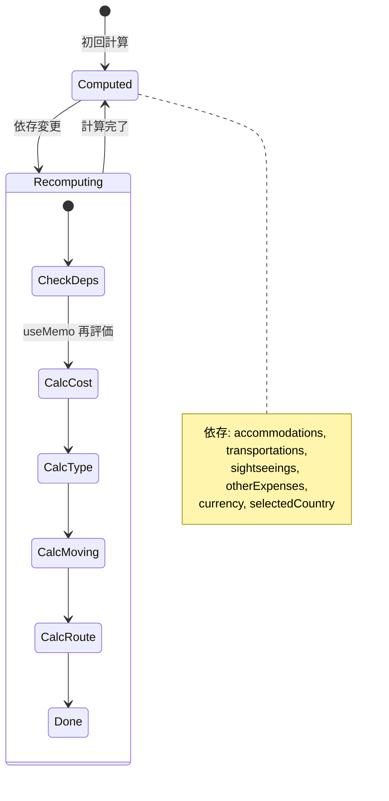
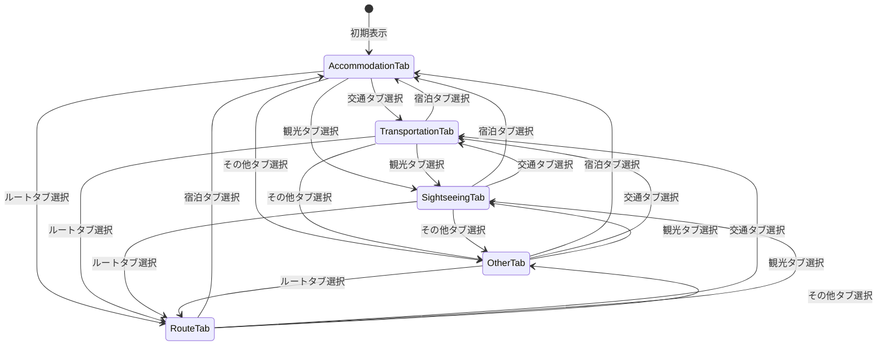

# 状態遷移図

## 表示モード状態遷移



## アプリケーション初期化状態



## CSVインポート状態



## useTravelData 状態遷移



## useFilterState 状態遷移

```mermaid
stateDiagram-v2
    [*] --> NoFilter : 初期状態

    NoFilter --> CountrySelected : setCountry(国)
    CountrySelected --> RegionSelected : setRegion(地域)
    CountrySelected --> NoFilter : setCountry(null)
    RegionSelected --> CountrySelected : setRegion(null)
    RegionSelected --> NoFilter : clearFilters

    CountrySelected --> CountrySelected : setCountry(別の国)\n※ region は null にリセット
    CountrySelected --> NoFilter : clearFilters

    state NoFilter {
        country = null
        region = null
        ---
        ワールドモード
    }

    state CountrySelected {
        country = 値あり
        region_ = null
        ---
        カントリーモード
    }

    state RegionSelected {
        country_ = 値あり
        region = 値あり
        ---
        リージョンモード
    }

    note right of NoFilter
        各トグル・日付変更は
        モード遷移に影響しない
        （フィルタ済みデータのみ変化）
    end note
```

## useStats 再計算トリガー



## タブ切替状態


