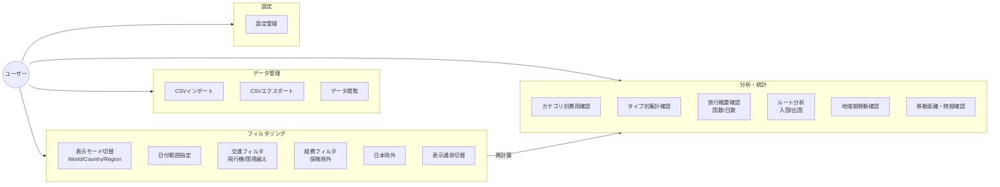
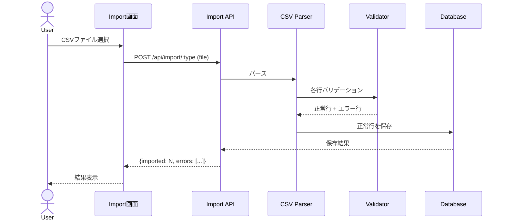
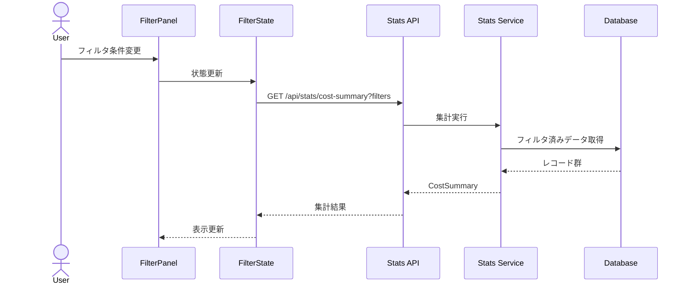

# ユースケース図

## 全体ユースケース

```mermaid
graph LR
    User((ユーザー))

    subgraph DataManagement["データ管理"]
        UC1[CSVインポート]
        UC2[CSVエクスポート]
        UC3[データ閲覧]
    end

    subgraph Filtering["フィルタリング"]
        UC4[表示モード切替<br/>World/Country/Region]
        UC5[日付範囲指定]
        UC6[交通フィルタ<br/>飛行機/国境越え]
        UC7[経費フィルタ<br/>保険除外]
        UC8[日本除外]
        UC9[表示通貨切替]
    end

    subgraph Analytics["分析・統計"]
        UC10[カテゴリ別費用確認]
        UC11[タイプ別集計確認]
        UC12[旅行概要確認<br/>国数/日数]
        UC13[ルート分析<br/>入国/出国]
        UC14[地域間移動確認]
        UC15[移動距離・時間確認]
    end

    subgraph Settings["設定"]
        UC16[設定管理]
    end

    User --> DataManagement
    User --> Filtering
    User --> Analytics
    User --> Settings
    Filtering -->|再計算| Analytics
```

## ユースケース詳細: CSVインポート

```mermaid
sequenceDiagram
    actor User
    participant UI as Import画面
    participant API as Import API
    participant CSV as CSV Parser
    participant Validator as Validator
    participant DB as Database

    User->>UI: CSVファイル選択
    UI->>API: POST /api/import/:type (file)
    API->>CSV: パース
    CSV->>Validator: 各行バリデーション
    Validator-->>CSV: 正常行 + エラー行
    CSV->>DB: 正常行を保存
    DB-->>API: 保存結果
    API-->>UI: {imported: N, errors: [...]}
    UI-->>User: 結果表示
```

## ユースケース詳細: フィルタ→集計

```mermaid
sequenceDiagram
    actor User
    participant Filter as FilterPanel
    participant State as FilterState
    participant API as Stats API
    participant Service as Stats Service
    participant DB as Database

    User->>Filter: フィルタ条件変更
    Filter->>State: 状態更新
    State->>API: GET /api/stats/cost-summary?filters
    API->>Service: 集計実行
    Service->>DB: フィルタ済みデータ取得
    DB-->>Service: レコード群
    Service-->>API: CostSummary
    API-->>State: 集計結果
    State-->>Filter: 表示更新
```
