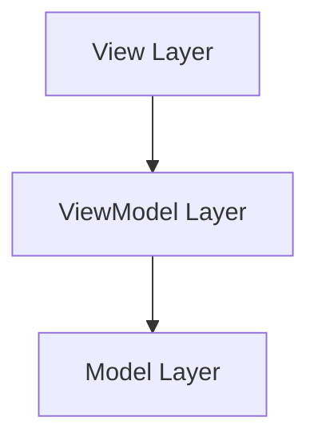
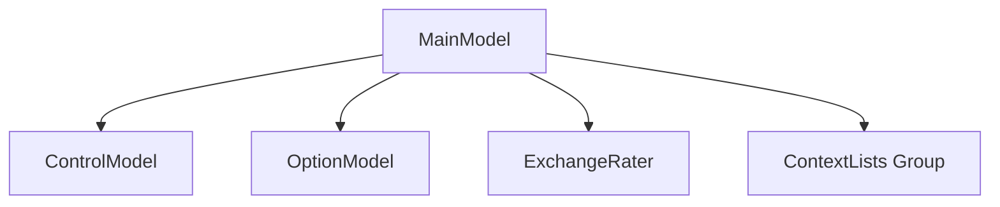
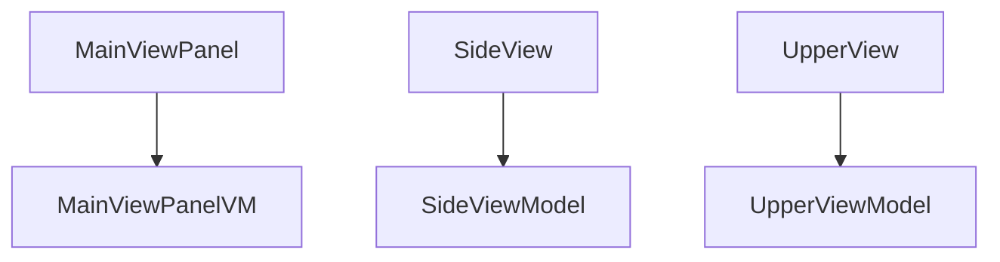

# Architecture Diagram (Hierarchical)

## Level 1: System Overview

```mermaid
graph TD
    View[View Layer]
    VM[ViewModel Layer]
    Model[Model Layer]

    View --> VM
    VM --> Model
```

## Level 2: Model Layer Internal

```mermaid
graph TD
    Main[MainModel]
    Control[ControlModel]
    Option[OptionModel]
    Exchange[ExchangeRater]
    Lists[ContextLists Group]

    Main --> Control
    Main --> Option
    Main --> Exchange
    Main --> Lists
```

## Level 2: UI Layer Internal (Main Mapping)

```mermaid
graph TD
    MainPanel[MainViewPanel]
    Side[SideView]
    Upper[UpperView]
    
    MainPanelVM[MainViewPanelVM]
    SideVM[SideViewModel]
    UpperVM[UpperViewModel]

    MainPanel --> MainPanelVM
    Side --> SideVM
    Upper --> UpperVM
```
