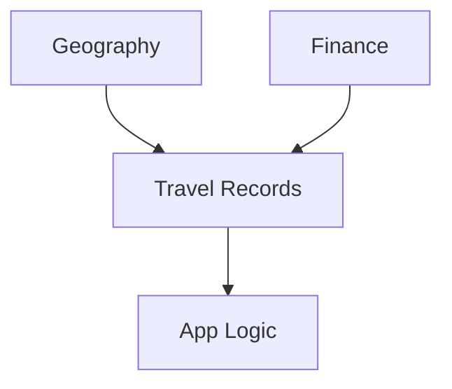
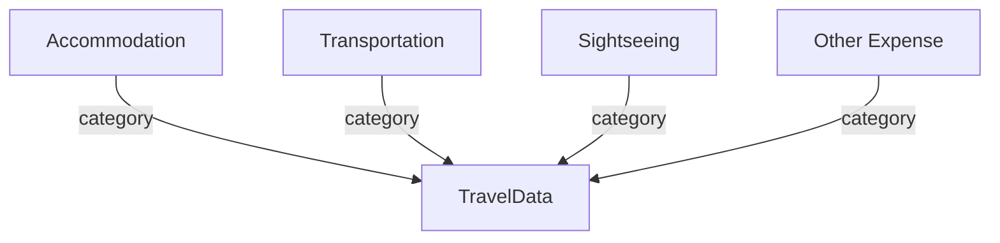
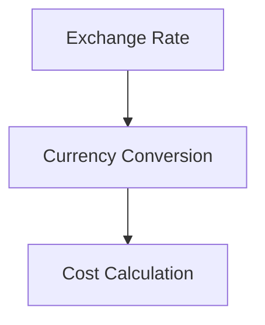

# Domain Diagram (Hierarchical)

## Level 1: Domain Overview

```mermaid
graph TD
    Records[Travel Records]
    Geo[Geography]
    Finance[Finance]
    Logic[App Logic]

    Geo --> Records
    Finance --> Records
    Records --> Logic
```

## Level 2: Travel Records Category

```mermaid
graph TD
    Stay[Accommodation]
    Move[Transportation]
    Activity[Sightseeing]
    Misc[Other Expense]

    Stay -- category --> TravelData
    Move -- category --> TravelData
    Activity -- category --> TravelData
    Misc -- category --> TravelData
```

## Level 2: Finance Domain Detail

```mermaid
graph TD
    ExchangeRate[Exchange Rate]
    Conversion[Currency Conversion]
    Calc[Cost Calculation]

    ExchangeRate --> Conversion
    Conversion --> Calc
```
