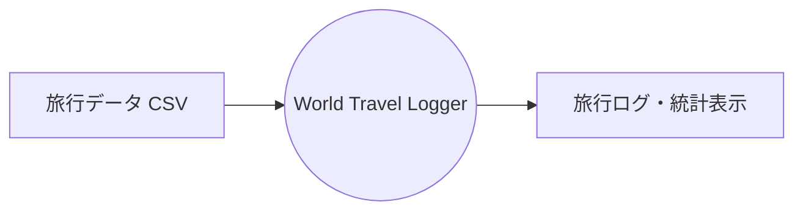
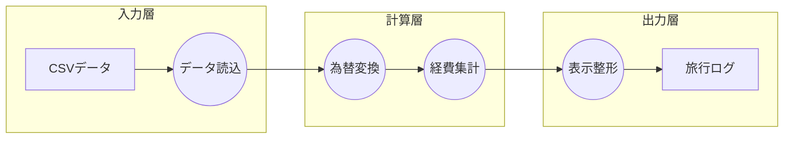

# Process Flow Diagram (PFD)

## Level 0: System Context
システム全体のインプット・プロセス・アウトプットの構成です。

```mermaid
graph LR
    I[旅行データ CSV] --> P((World Travel Logger))
    P --> O[旅行ログ・統計表示]
```

## Level 1: Functional Process Flow
詳細な機能レベルのフローです。各データは読み込まれた後、為替レートに基づき計算・集計され、画面表示用に整形されます。

```mermaid
graph LR
    subgraph InputGroup [入力層]
        direction LR
        I[CSVデータ] --> P1((データ読込))
    end

    subgraph ProcessGroup [計算層]
        direction LR
        P1 --> P2((為替変換))
        P2 --> P3((経費集計))
    end

    subgraph OutputGroup [出力層]
        direction LR
        P3 --> P4((表示整形))
        P4 --> O[旅行ログ]
    end
```
