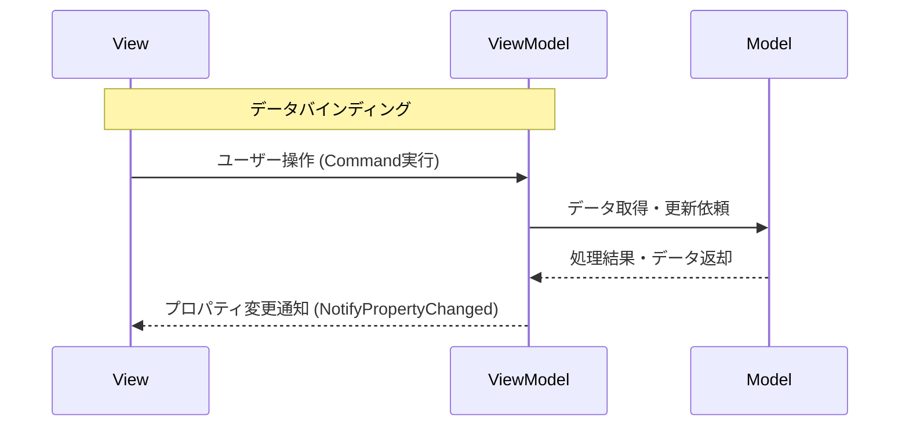

# MVVM Sequence Diagram

View、ViewModel、Model 間の基本的な相互作用（データバインディング、コマンド実行、通知）を示すシーケンス図です。

```mermaid
sequenceDiagram
    participant V as View
    participant VM as ViewModel
    participant M as Model

    Note over V, VM: データバインディング
    V->>VM: ユーザー操作 (Command実行)
    VM->>M: データ取得・更新依頼
    M-->>VM: 処理結果・データ返却
    VM-->>V: プロパティ変更通知 (NotifyPropertyChanged)
```
