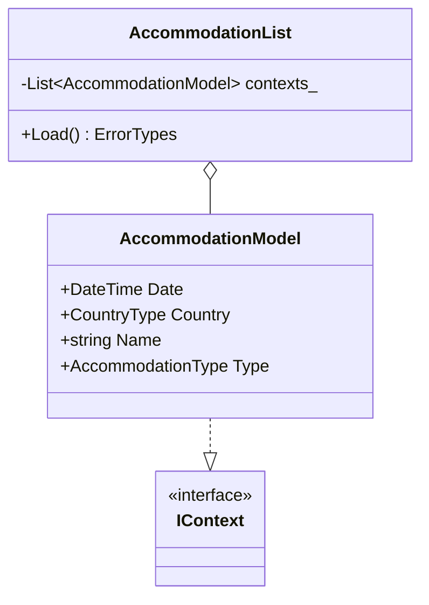

# Class Diagram: Accommodation Category

```mermaid
classDiagram
    class AccommodationList {
        -List~AccommodationModel~ contexts_
        +Load() ErrorTypes
    }
    class AccommodationModel {
        +DateTime Date
        +CountryType Country
        +string Name
        +AccommodationType Type
    }
    class IContext { <<interface>> }

    AccommodationList o-- AccommodationModel
    AccommodationModel ..|> IContext
```
