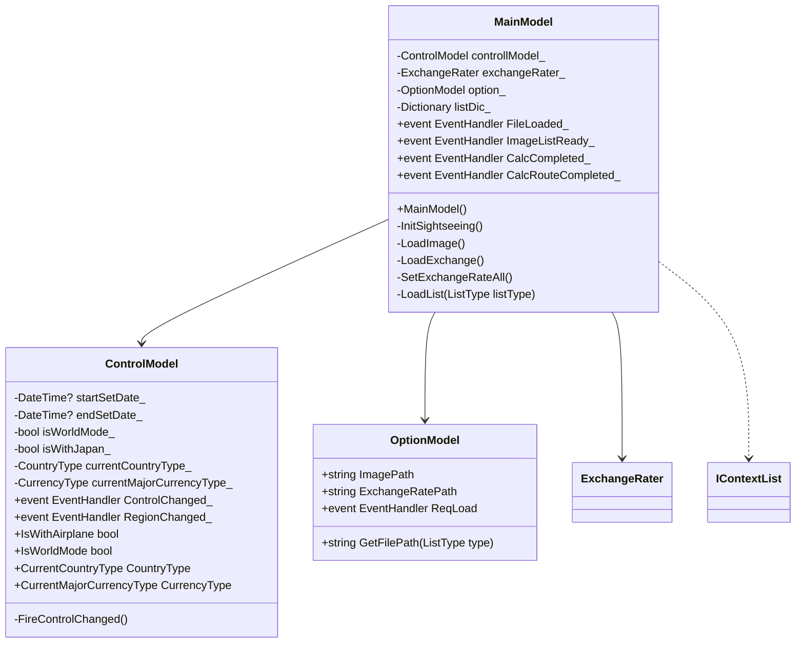

# Core Domain Class Diagram

```mermaid
classDiagram
    class MainModel {
        -ControlModel controllModel_
        -ExchangeRater exchangeRater_
        -OptionModel option_
        -Dictionary<ContextListType, IContextList> listDic_
        +event EventHandler<FileLoadedEventArgs> FileLoaded_
        +event EventHandler ImageListReady_
        +event EventHandler CalcCompleted_
        +event EventHandler CalcRouteCompleted_
        +MainModel()
        -InitSightseeing()
        -LoadImage()
        -LoadExchange()
        -SetExchangeRateAll()
        -LoadList(ListType listType)
    }

    class ControlModel {
        -DateTime? startSetDate_
        -DateTime? endSetDate_
        -bool isWorldMode_
        -bool isWithJapan_
        -CountryType currentCountryType_
        -CurrencyType currentMajorCurrencyType_
        +event EventHandler ControlChanged_
        +event EventHandler RegionChanged_
        +IsWithAirplane bool
        +IsWorldMode bool
        +CurrentCountryType CountryType
        +CurrentMajorCurrencyType CurrencyType
        -FireControlChanged()
    }

    class OptionModel {
        +string ImagePath
        +string ExchangeRatePath
        +string GetFilePath(ListType type)
        +event EventHandler ReqLoad
    }

    MainModel --> ControlModel
    MainModel --> OptionModel
    MainModel --> ExchangeRater
    MainModel ..> IContextList
```
