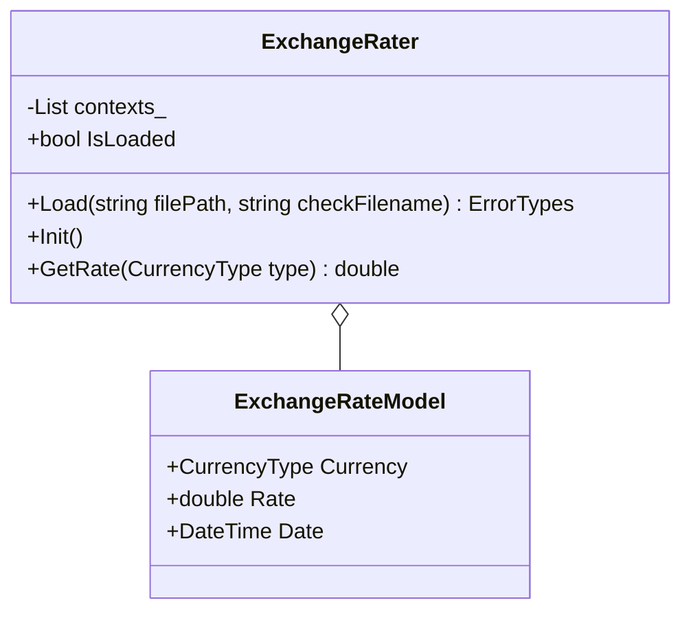

# Currency Domain Class Diagram

```mermaid
classDiagram
    class ExchangeRater {
        -List<ExchangeRateModel> contexts_
        +bool IsLoaded
        +Load(string filePath, string checkFilename) ErrorTypes
        +Init()
        +GetRate(CurrencyType type) double
    }

    class ExchangeRateModel {
        +CurrencyType Currency
        +double Rate
        +DateTime Date
    }

    ExchangeRater o-- ExchangeRateModel
```
