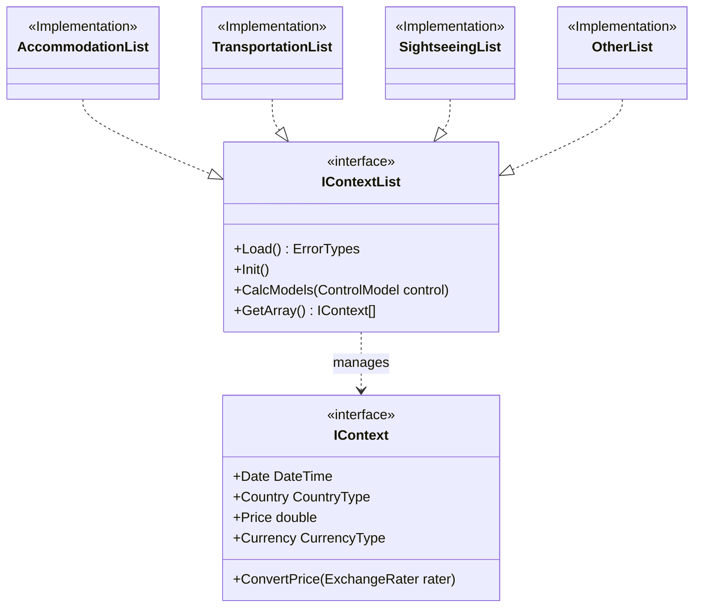

# Class Diagram: Context List Abstraction

## Abstraction Level

```mermaid
classDiagram
    class IContextList {
        <<interface>>
        +Load() ErrorTypes
        +Init()
        +CalcModels(ControlModel control)
        +GetArray() IContext[]
    }
    class IContext {
        <<interface>>
        +Date DateTime
        +Country CountryType
        +Price double
        +Currency CurrencyType
        +ConvertPrice(ExchangeRater rater)
    }
    class AccommodationList { <<Implementation>> }
    class TransportationList { <<Implementation>> }
    class SightseeingList { <<Implementation>> }
    class OtherList { <<Implementation>> }

    AccommodationList ..|> IContextList
    TransportationList ..|> IContextList
    SightseeingList ..|> IContextList
    OtherList ..|> IContextList
    IContextList ..> IContext : manages
```
