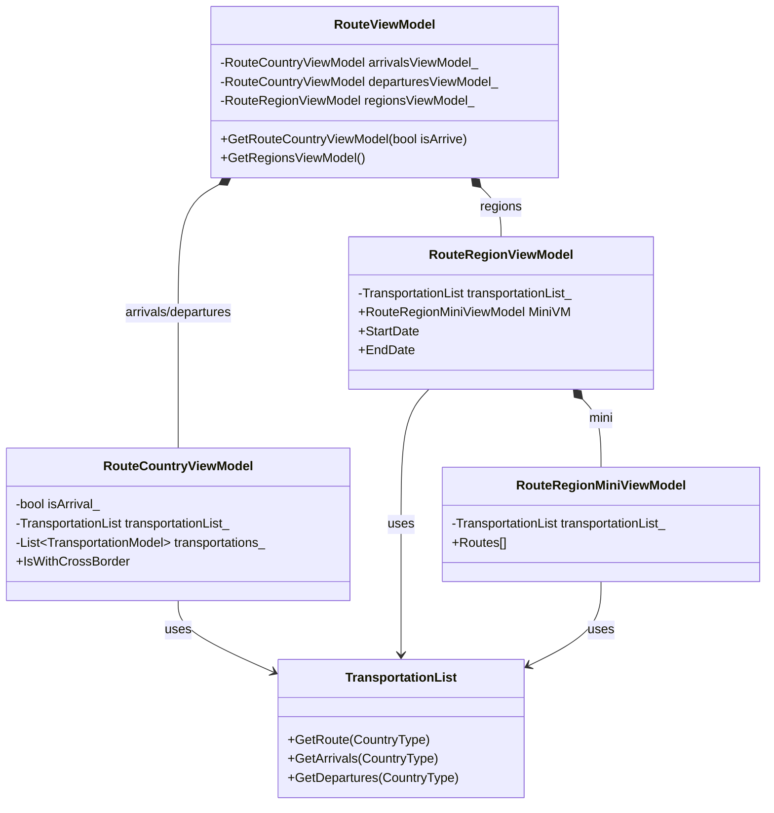

# Route Design (MVVM)

## Route Classes Overview
Route表示は、主に輸送データ（Transportation）を元に、特定の国への入国・国内移動・出国の流れを可視化する機能です。

## Responsibilities
- **RouteViewModel**: Routeタブ全体の親ViewModel。到着、出発、国内移動の各子ViewModelを管理する。
- **RouteCountryViewModel**: 特定の国への到着（Arrival）またはその国からの出発（Departure）に関する情報を管理する。
- **RouteRegionViewModel**: 国内での滞在期間や地域情報を管理する。
- **RouteRegionMiniViewModel**: 国内での移動経路（Routes）のリスト表示用データを管理する。
- **TransportationList**: モデル層で、特定の国の移動データをフィルタリングして提供する。
