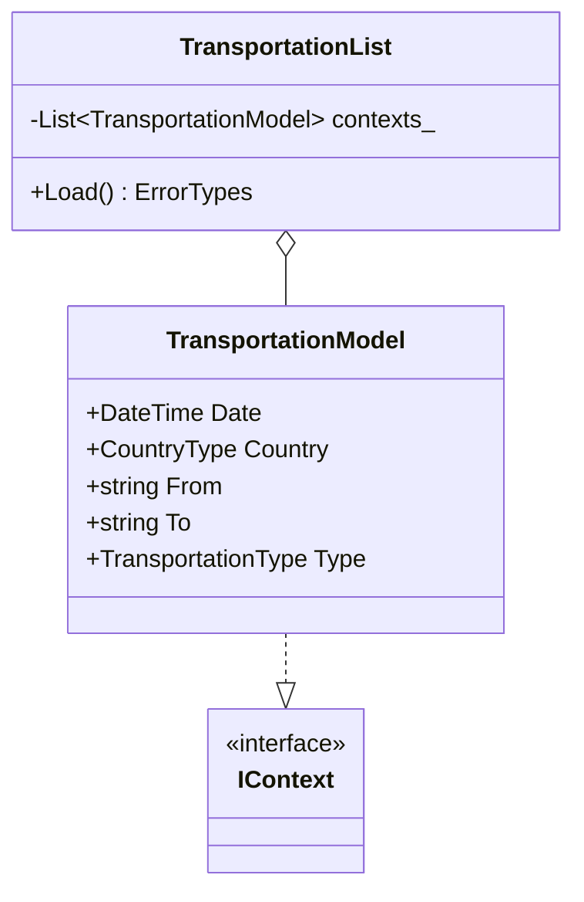

# Class Diagram: Transportation Category

```mermaid
classDiagram
    class TransportationList {
        -List~TransportationModel~ contexts_
        +Load() ErrorTypes
    }
    class TransportationModel {
        +DateTime Date
        +CountryType Country
        +string From
        +string To
        +TransportationType Type
    }
    class IContext { <<interface>> }

    TransportationList o-- TransportationModel
    TransportationModel ..|> IContext
```
