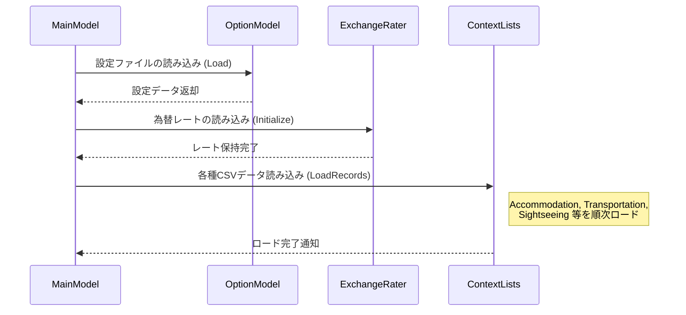

# Initialization Sequence (Model Layer)

アプリケーション起動時の、モデル層におけるデータの読み込みとコンポーネントの初期化フローです。

```mermaid
sequenceDiagram
    participant M as MainModel
    participant O as OptionModel
    participant E as ExchangeRater
    participant L as ContextLists

    M->>O: 設定ファイルの読み込み (Load)
    O-->>M: 設定データ返却

    M->>E: 為替レートの読み込み (Initialize)
    E-->>M: レート保持完了

    M->>L: 各種CSVデータ読み込み (LoadRecords)
    Note right of L: Accommodation, Transportation, <br/>Sightseeing 等を順次ロード
    L-->>M: ロード完了通知
```
