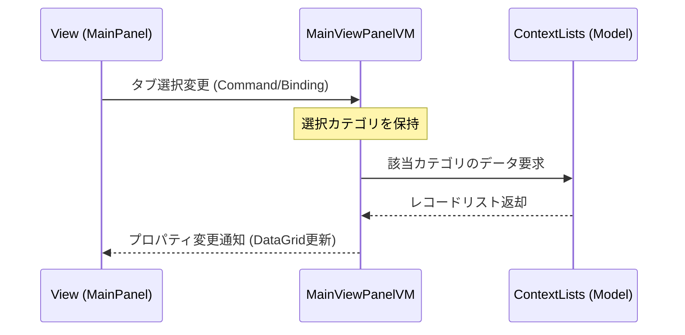

# Tab Selection Sequence

ユーザーがタブ（宿泊、移動、観光等）を切り替えた際の、ViewからModelまでのデータ取得フローです。

```mermaid
sequenceDiagram
    participant V as View (MainPanel)
    participant VM as MainViewPanelVM
    participant M as ContextLists (Model)

    V->>VM: タブ選択変更 (Command/Binding)
    Note over VM: 選択カテゴリを保持
    VM->>M: 該当カテゴリのデータ要求
    M-->>VM: レコードリスト返却
    VM-->>V: プロパティ変更通知 (DataGrid更新)
```
